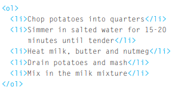
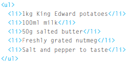

# Lists

- Ordered Lists

The ordered list is created with
the element.

- unordered list

 

- The definition list is created with the <dl.> element and usually
consists of a series of terms and
their definitions.

# Boxes

 Box Dimensions

By default a box is sized just big
enough to hold its contents. To
set your own dimensions for a
box you can use the height and
width properties.

Limiting Width
min-width, max-width

# ARRAYS

An array is a special type of variable. It doesn't
just store one value; it stores a list of values

var colors;

colors ['white', 'black', 'custom']

#  IF ... ELSE STATEMENTS 

allows you
to provide two sets of code:
1. one set if the condition
evaluates to true
2. another set if the condition is
false 

#  SWITCH STATEMENTS

use many case in  SWITCH

