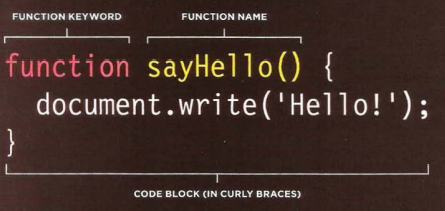

[GitHub Pages](https://github.com/haneenzyad98/Reading-notes/blob/main/201/class-04.md)

# Ch4 Links

links allow you to move from
one web page to another.

created using the a tag:

## mailto: 
To create a link that starts up the user's email program and addresses an email to a specified email address

## target
If you want a link to open in a new window, you can use the
target 

<a href="mailto:haneenzyad98@gmail.com" target="_blank">
Email haneen</a>

_____________________

## Linking to a Specific Part of the Same Page

At the top of a long page
you might want to add a list
of contents that links to the
corresponding sections lower
down. Or you might want to add
a link from part way down the
page back to the top of it to save users from having to scroll back to the top.

will creat id for top page 
then call it like links 

# Ch15 Layout

In normal flow, each block-level
element sits on top of the next
one. Since this is the default
way in which browsers treat
HTML elements, you do not
need a CSS property to indicate
that elements should appear
in normal flow, but the syntax
would be:

position: static;

position:relative

position:absolute

position:fixed

# Ch3 Functions, Methods, and Objects

Functions let you group a series of statements together to perform a specific task.

##  Pair Programming

While there are many different styles, pair programming commonly involves two roles: the Driver and the Navigator. The Driver is the programmer who is typing and the only one whose hands are on the keyboard. Handling the “mechanics” of coding, the Driver manages the text editor, switching files, version control, and—of course writing—code. The Navigator uses their words to guide the Driver but does not provide any direct input to the computer. The Navigator thinks about the big picture, what comes next, how an algorithm might be converted in to code, while scanning for typos or bugs. The Navigator might also utilize their computer as a second screen to look up solutions and documentation, but should not be writing any code.

