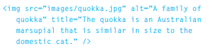

[GitHub Pages](https://github.com/haneenzyad98/Reading-notes/blob/main/201/class-05.md)

# Ch5    Images

Adding Images

height:

This specifies the height of themage in pixels.

width:

This specifies the width of the image in pixels.

## Where to Place Images in Your Code
1. before a paragraph
The paragraph starts on a new
line after the image.
2. inside the start of a
paragraph
The first row of text aligns with
the bottom of the image.
3. in the middle of a
paragraph
The image is placed between the
words of the paragraph that it
appears in.

## imge type :

- Vector Images: are
commonly created in programs such as Adobe
Illustrator.

- bitmap images

like natural view

JPGs, GIFs, and PNGs belong to
a type of image format known
as bitmap. They are made up of
lots of miniature squares. The
resolution of an image is the
number of squares that fit within
a 1 inch x 1 inch square area.

- Animated GIFs show several frames of an
image in sequence and therefore can be used to
create simple animations.

# Chapter 11: Color

The color property allows you to specify the color of text inside an element. 
You can specify any color in CSS in one of three ways:

- rgb values
These express colors in terms of how much red, green and blue are used to make it up. 
For example: rgb(100,100,90)

- hex codes
These are six-digit codes that represent the amount of red,green and blue in a color,preceded by a pound or hash #sign. 
For example: #ee3e80

- color names
There are 147 predefined color names that are recognized by browsers.
For example:DarkCyan

background-color

# Chapter 12: Text

There are properties to control the choice of font, size, weight, style, and spacing

There is a limited choice of fonts that you can assume
most people will have installed.

