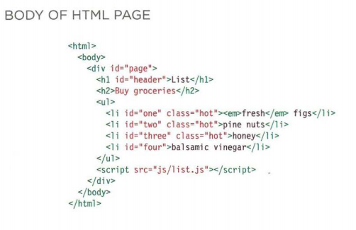

[GitHub Pages](https://haneenzyad98.github.io/Reading-notes/201/class-06.html)

# Ch3 Object Literals

Objects group together a set of variables and functions to create a model
of a something you would recognize from the real world. In an object,
variables and functions take on new names. 

Like variables and named functions,
properties and methods have a
name and a value. In an object,
that name is called a key. 

# Ch5 Document Object Model

The browser represents the page using a DOM tree.

THE DOM TREE IS A
MODEL OF A WEB PAGE

getElementByld

Selects an individual element given the value of its i d attribute .
The HTML must have an id attribute in order for it to be selectable.
First supported: IE5.5, Opera 7, all versions of Chrome, Firefox, Safari.

querySel ector

Uses CSS selector syntax that would select one or more elements .
This method returns only the first of the matching elements.

getEl ementsByClassNam

Selects one or more elements given the value of their cl ass attribute.
The HTML must have a cl ass attribute for it to be selectable.
This method is faster than querySe 1ectorA11 () .

From an element node, you can access and update its
content using properties such as textContent and
i nnerHTML or using DOM manipulation techniques. 

