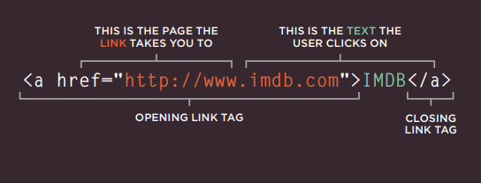
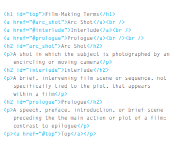

[GitHub Pages](https://haneenzyad98.github.io/Reading-notes/201/class-08.html)

# Ch4 Links

links allow you to move from
one web page to another.

created using the a tag:

## mailto: 
To create a link that starts up the user's email program and addresses an email to a specified email address

## target
If you want a link to open in a new window, you can use the
target 

<a href="mailto:haneenzyad98@gmail.com" target="_blank">
Email haneen</a>

_____________________

## Linking to a Specific Part of the Same Page

At the top of a long page
you might want to add a list
of contents that links to the
corresponding sections lower
down. Or you might want to add
a link from part way down the
page back to the top of it to save users from having to scroll back to the top.

will creat id for top page 
then call it like links 

# Ch15 Layout

In normal flow, each block-level
element sits on top of the next
one. Since this is the default
way in which browsers treat
HTML elements, you do not
need a CSS property to indicate
that elements should appear
in normal flow, but the syntax
would be:

position: static;

position:relative

position:absolute

position:fixed

## position:static

In normal flow, each block-level
element sits on top of the next
one. Since this is the default
way in which browsers treat
HTML elements, you do not
need a CSS property to indicate
that elements should appear
in normal flow, but the syntax
would be:
position: static;

## position:relative

Relative positioning moves an
element in relation to where it
would have been in normal flow.

## position:absolute

When the position property
is given a value of absolute,
the box is taken out of normal
flow and no longer affects the
position of other elements on
the page. (They act like it is not
there.) 

float :
The float property allows you
to take an element in normal
flow and place it as far to the
left or right of the containing
element as possible

