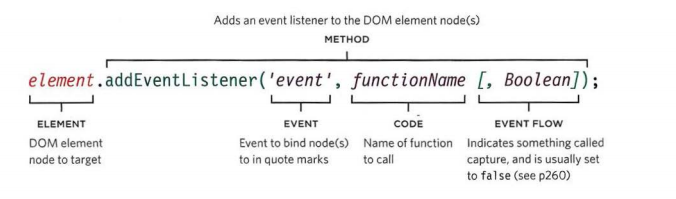

[GitHub Pages]()

# Ch7 Forms

 types of form controls

 - ADDING TEXT:

    Text input

    Password input

    Text are

- Making Choices:

    Radio buttons

    Checkboxes

    Drop-down boxes

- Submitting Forms:
  
  Submit buttons

  Image buttons
   
- Uploading Files:

  File upload
Allows users to upload files

# Ch14 Lists, Tables & Forms

The list-style-type allows you to control the shape
or style of a bullet point

Unordered Lists

Ordered Lists

decimal
1 2 3

decimal-leading-zero
01 02 03

lower-alpha
a b c

upper-alpha
A B C

lower-roman
i. ii. iii.

upper-roman
I II III

## Table Properties

width to set the width of the
table

padding to set the space
between the border of each table
cell and its content

text-transform to convert the
content of the table headers to
uppercase

letter-spacing, font-size
to add additional styling to the
content of the table headers

border-top, border-bottom
to set borders above and below
the table headers

text-align to align the writing
to the left of some table cells and
to the right of the others

background-color to change
the background color of the
alternating table rows

:hover to highlight a table row
when a user's mouse goes over it

# Ch6 Events

Events occur when users
click or tap on a link, hove
or swipe over an element t ype on the keyboard,resize the window, or
when the page they requested has loaded.

Event listeners are a more recent approach to handling events.
They can deal with more than one function at a time
but they are not supported in older browsers. 

