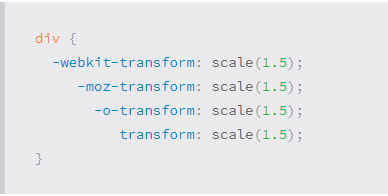
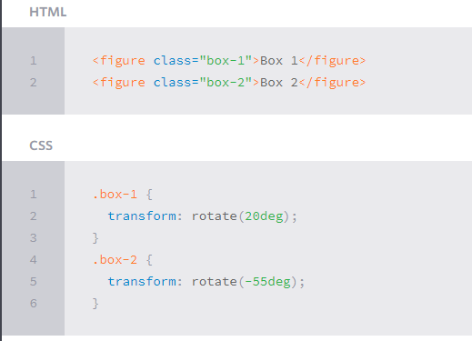
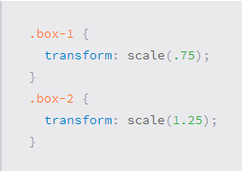

# What Google Learned From Its Quest to Build the Perfect Team

Our data-saturated age enables us to examine our work habits and office quirks with a scrutiny

says Marshall Van Alstyne, a professor at Boston University who studies how people share information:We’re living through a golden age of understanding personal productivity,’’  ‘‘All of a sudden, we can pick apart the small choices that all of us make, decisions most of us don’t even notice, and figure out why some people are so much more effective than everyone else.’’

the bulk of modern work is more and more team-based

an employee’s day it is spent  more than three-quarters communicating with colleagues.

‘‘group norms.’’ Norms are the traditions, behavioral standards and unwritten rules that govern how we function when we gather: One team may come to a consensus that avoiding disagreement is more valuable than debate; another team might develop a culture that encourages vigorous arguments and spurns groupthink

## Transforms

ypu can play whit rotat of images and scale
Transform Syntax
The actual syntax for the transform property is quite simple, including the transform property followed by the value. The value specifies the transform type followed by a specific amount inside parentheses.

### 2D Transforms
- 2D Rotate

- 2D Scale

allows you to change the appeared size of an element

- 2D Translate
 
- 2D Skew

- Combining Transforms Demo

- 2D Cube Demo

## Transitions & Animations

Transitions
As mentioned, for a transition to take place, an element must have a change in state, and different styles must be identified for each state.

There are four transition:

- transition-property
- transition-duration
- transition-timing-function
- transition-delay

## Fade in

it is make the page as gray whin you are hover in out border of bage.

Fade in effects are coded in two steps: first, you set the initial state; next, you set the change

.fade
{
        opacity:0.5;
}

.fade:hover
{
        opacity:1;
}

##  Change color

Animating a change of color used to be unbelievably complex, with all kinds of math involved in calculating separate RGB values and then recombining them.

## Grow & Shrink

To grow an element, you used to have to use its width and height, or its padding. But now we can use CSS3’s transform to enlarge.

