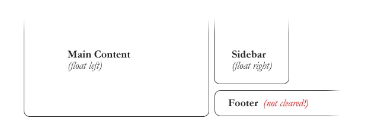

# Responsive Web Design

it make website suitable to work on any device and any screen size no matter pc or mobile.

Responsive generally means to react quickly and positively to any change, while adaptive means to be easily modified for a new purpose or situation.

## Responsive web design is broken down into three main components:

- Flexible Layouts

 is the practice of building a web site layout with a flexible grid capable of dynamically scaling to any width.

 - Media Queries

  built as an extension to media types commonly found when targeting and including styles. Media queries provide the ability to specify different styles for individual browser and device circumstances, the width of the viewport or device orientation.

     - Initializing Media Queries

    using the @media rule inside of an existing style sheet, importing a new style sheet using the @import rule, or by linking to a separate style sheet from within the HTML document. Generally speaking it is recommend to use the @media rule inside of an existing style sheet to avoid any additional HTTP requests.

      * @media Rule
    @media all and (max-width: 1024px) {...}

      * @import Rule 
     @import url(styles.css) all and (max-width: 1024px) {...}

    - Logical Operators in Media Queries

    and, not, and only

    (and) logical operator within a media query allows an extra condition to be added.

     (not) logical operator negates the query, specifying any query but the one identified.

     (only) logical operator is a new operator and is not recognized by user agents using the HTML4 algorithm, thus hiding the styles from devices or browsers that don’t support media queries. 

  - Flexible Media

  One quick way to make media scalable is by using the max-width property with a value of 100%. Doing so ensures that as the viewport gets smaller any media will scale down according to its containers width.

  Flexible Embedded Media

----------------------------

# Floats

you can float the element to the right or to left .

 wrapping text around images,helpful for layout in smaller instances.

 ### Clearing the Float

- The Empty Div Method.

- The Overflow Method.

- The Overflow Method relies on setting the overflow CSS property on a parent element.

- The Easy Clearing Method.

  

