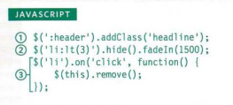
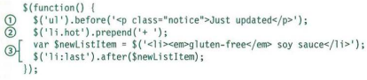

# Ch7  jQuery 

It is js file help you to select element from html by css selectors and do any thing with it by jQuery methods.

     by using $
       example with id selector 
       --->  $('#id')

* in jQuery you can use many methods to deal with element you select

      $(li.hot).addClass('')

     

 jQuery it makes coding simpler. 

## jQuery Selection

 - single element 
     
        $('ul')

 - multiple element
  
         $('li')

 - get and set data in jQuery    

        The • htm 1 () and • text () methods both retrieve and update the content 
        of elements.

        $('li').html()

        to get information from an element it will return the first element.

         $('li').html('update')

         to update content for each element in list

 - LOOPING 
 
  
         by forEach method

 - If you want to use more than 
   jQuery method on the same 
   selection of elements, you can 
   list several methods at a time 
   using dot notation to separate 
   each one.

        $( 'l i [i d!="one"] ') . hide() .delay(SOO). fadeln(1400);

- INSERTING ELEMENTS 

    *  Create the new elements in a jQuery object .

           var $newFragment = $('<li>'}; 

    * Use a method to insert the content into the page .

            .before() 
            .after() 
            .after() 
            .append() 

 

## GETTING AND SETTING ATTRIBUTE VALUES 

           $( ' li#one').attr('id'); 
           $('1 i #one') . removeAttr (' i d' };

## GETTING & SETTING CSS PROPERTIES    

        $( 'li ') .css( 'background- color' , '1272727');         

### LOADING JQUERY FROM A CDN        

     <script src=" //ajax .googl eapi s . com/ ajax/l i bs/ jquery / 1.10. 2/ jquery .min. js "> 
     </ script>

# Pair Programming

Driver and the Navigator. 

he Driver is the programmer who is typing and the only one whose hands are on the keyboard.

 The Navigator thinks about the big picture, what comes next, how an algorithm might be converted in to code, while scanning for typos or bugs.

 - Greater efficiency
 - Engaged collaboration
 - Learning from fellow students
 - Social skills
 - Job interview readiness
 - Work environment readiness

