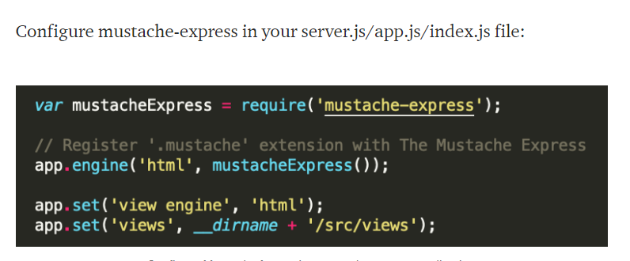

# Javascript Templating

Javascript templating is a fast and efficient technique to render client-side view templates with Javascript by using a JSON data source. 

Mustache is a logic-less template syntax. It can be used for HTML, config files, source code — anything.

          Mustache.render(“Hello, {{name}}”, {name:“Sherlynn” });
          // returns: Hello, Sherlynn

Mustache-Express To install:
  

           $ npm install mustache --save

           

# Flexbox

makes it easier to design flexible responsive layout structure without using float or positioning.

give the container the ability to alter its items’ width/height (and order) to best fill the available space .

 you must add display: flex; to make it affect 

 - flex-wrap
 - flex-direction
 - flex-grow
 - align-self
