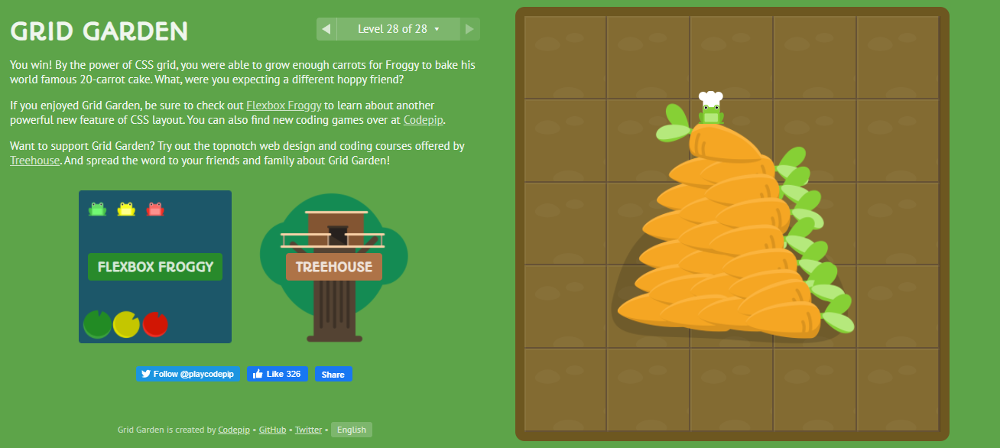

# CSS Grid

CSS Grid Layout (aka “Grid”), is a two-dimensional grid-based layout system that aims to do nothing less than completely change the way we design grid-based user interfaces.

- Grid Container
- Grid Item
- Grid Line
- Grid Cell
- Grid Track
- Grid Area

       .container {
        display: grid | inline-grid;
         }

       .container {
      grid-template:
      [row1-start] "header header header" 25px [row1-end]
      [row2-start] "footer footer footer" 25px [row2-end]
      / auto 50px auto;
}

 