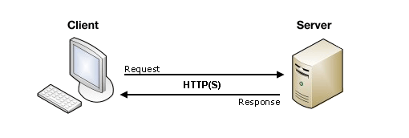
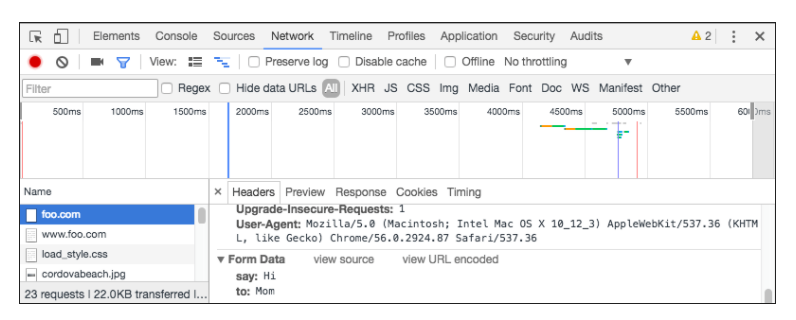

# Sending form data

Client/server architecture

what happens to the data when a form is submitted

 

An HTML form on a web page is nothing more than a convenient user-friendly way to configure an HTTP request to send data to a server. This enables the user to provide information to be delivered in the HTTP request.

## On the client side: 

 action and method.

 The action attribute defines where the data gets sent. Its value must be a valid relative or absolute URL. If this attribute isn't provided, the data will be sent to the URL of the page containing the form — the current page.

          <form action="https://example.com">

## The method attribute:

The method attribute defines how data is sent. The HTTP protocol provides several ways to perform a request; HTML form data can be transmitted via a number of different methods, the most common being the GET method and the POST method

## The POST method

The POST method is a little different. It's the method the browser uses to talk to the server when asking for a response that takes into account the data provided in the body of the HTTP request: "Hey server, take a look at this data and send me back an appropriate result." If a form is sent using this method, the data is appended to the body of the HTTP request.

## To Viewing HTTP requests:

Open the developer tools.

Select "Network"

Select "All"

Select "foo.com" in the "Name" tab

Select "Headers"

