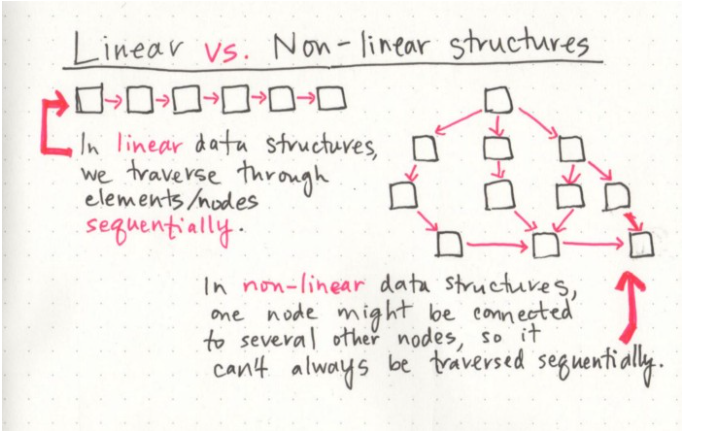

# Linked List

sequence of Nodes that are connected/linked to each other.

 

types of Linked List 
 

- linked list means that there is only one reference, and the reference points to the Next node in a linked list.

- A Doubly linked list means that there is a reference to both the Next and Previous node.

- Head - The Head is a reference of type Node to the first node in a linked list.

 