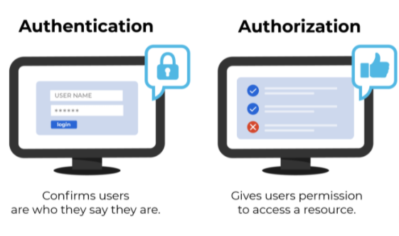

# Authentication

- Explain what a “Singleton” is (in Computer Science terms)

A singleton is a class that allows only a single instance of itself to be created and gives access to that created instance.

- Explain how the Singleton pattern can be used with Node modules, specifically with classes

Sometimes you need to make sure that you have one and only one instance of an object. This is where the singleton pattern can be useful. A singleton represents a single instance of an object. Only one can be created, no matter how many times the object is instantiated.

- If you were tasked with building a middleware system like Express uses, what approach might you take to construct/operate it?
        

        const express = require('express');
          const app = express();

          app.get('/', (req, res, next) => {
          res.send('Welcome Home');
            });

              app.listen(3000);

- Router Middleware

bind instance of the app object by using the app.use() and app.METHOD() functions, where METHOD is the HTTP method of the request that the middleware function handles (such as GET, PUT, or POST) in lowercase.
bound to an instance of express.Router().

    var router = express.Router()

- Dynamic Module Loading

is a mechanism by which a computer program can, at run time, load a library (or other binary) into memory, retrieve the addresses of functions and variables contained in the library, execute those functions or access those variables, and unload the library from memory.

- CRUD -> REST Method Matches

Create = PUT with a new URI
         POST to a base URI returning a newly created URI

Read   = GET

Update = PUT with an existing URI

Delete = DELETE

- Mock Testing

Mocks are usually created by using the third-party library such as Mockito, JMock, and WireMock.

- Authentication is the process of verifying that an individual, entity or website is whom it claims to be. Authentication in the context of web applications is commonly performed by submitting a username or ID and one or more items of private information that only a given user should know.

- Cryptographic hash algorithms MD5, SHA1, SHA256, SHA512, SHA-3 are general purpose hash functions, designed to calculate a digest of huge amounts of data in as short a time as possible. Hashing is the greatest way for protecting passwords and considered to be pretty safe for ensuring the integrity of data or password.

- Basic access authentication

is a method for an HTTP user agent to provide a user name and password when making a request. In basic HTTP authentication, a request contains a header field in the form of Authorization: Basic <credentials>, where credentials is the Base64 encoding of ID and password joined by a single colon :

- node.bcrypt.js

Per bcrypt implementation, only the first 72 bytes of a string are used. Any extra bytes are ignored when matching passwords.

 