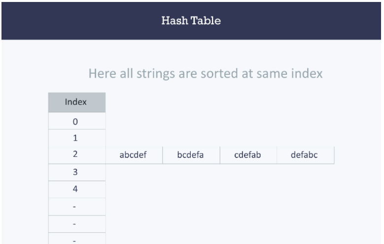

# Hash Tables

Hash - A hash is the result of some algorithm taking an incoming string and converting it into a value that could be used for either security or some other purpose. In the case of a hashtable, it is used to determine the index of the array.

Hashing is a technique that is used to uniquely identify a specific object from a group of similar objects.

- Why  Hash Tables

Hold unique values

Dictionary

Library

