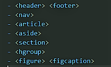
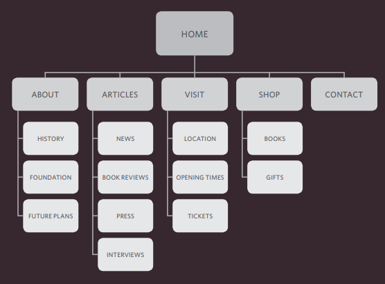
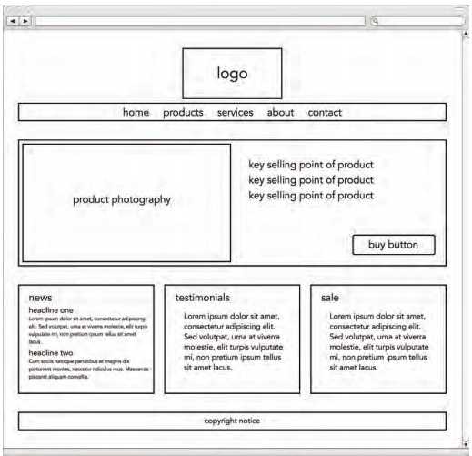

#  CH17 HTML5 Layout

## Traditional HTML Layouts
 - web page authors used 
 elements to group
together related elements on the page

##  the structure of the page 
1. At the top of the page is the
header, containing a logo and the
primary navigation.
2. Under this are one or more
articles or posts.
3. the right side perhaps featuring
a search option, links to other
recent articles, other sections of
the site, or even ads
4. When coding a site like this,
developers would usually put
these main sections of the page
inside 
 elements and use
the class or id attributes to
indicate the purpose of that part
of the page.

## New Html5 Layout Elements
HTML5 introduces a new set of elements that allow you to divide up the
parts of a page 
it is diffirant then Traditional HTML  many
of the 
 elements have been
replaced by new HTML5 layout
elements.

##  Some Example of tags

# CH18 Process & Design

First you want to create a list
of reasons why people would
be coming to your site. You can
then assign the list of tasks to
the fictional visitors you created
in the step described on the
previous page.

Your content and design should
be influenced by the goals of
your users.

To help determine why people
are coming to your website,
there are two basic categories of
questions you can ask:

1.  The first attempts to discover
the underlying motivations for
why visitors come to the site.
2.  The second examines the
specific goals of the visitors.
These are the triggers making
them come to the site now.

### Site Maps 
 mean a create a diagram
of the pages that will be used
to structure the site

you will  know what needs to appear
on your site, you can start to organize the
information into sections or pages

*Example of Site Maps*

# WireFrames:
 is a simple sketch of the key
information that needs to go on each page of a
site. It shows the hierarchy of the information
and how much space it might require.

## Designing Navigation
helps them understand what your site is about and how it is organized.

# CH8 Extra Markup

- You can add comments to your code between the
<!-- and --> markers.
- The id and class attributes allow you to identify particular elements.
- The 
 and  elements allow you to group
block-level and inline elements together.
- <iframes> cut windows into your web pages through
which other pages can be displayed.
