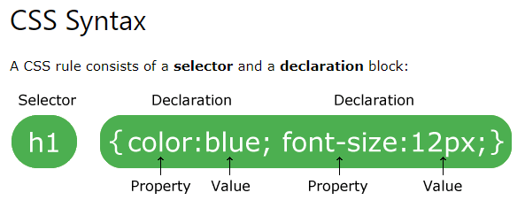

# FUNCTION
group a series of statements together to perform a
specific task.

- declaration :

function functionName( ){

    input
    code
    output
     

        return output
}
functionName()

--------------------------

- expressions :

 var name = function( ){

code 

 }
 name();

 # CSS
 
 
  Cascading Style Sheets

  CSS is responsible for presentation

  
